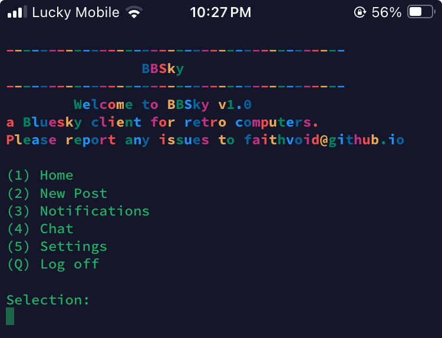
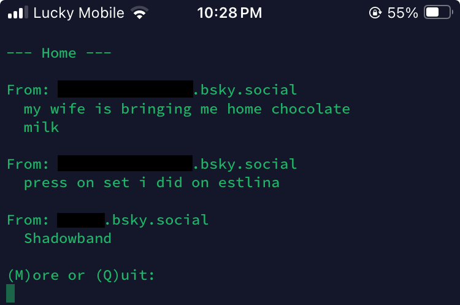

# BBSky
Telnet server for Bluesky (and other ATProto servers), for connecting to Bluesky/ATProto servers on retro computers.

## Connection
- In your telnet terminal of choice, connect to "placeholder:23"
- When asked, enter your Bluesky handle, and your app password (NOT your actual password!)
- Once connected, select the corresponding option you'd like to select, ie; your home feed, your messages, notifications, etc.
- To log off, just press "Q" at the main menu.

## Installation (server)
- Install "atproto" via pip ("pip install atproto")
- Copy the latest "BBSky-Server" release from releases
- Run "python3 bbsky-server.py"
- Once you see "BBSky is running on port 23", you can connect to your BBSky telnet instance by typing in your IP address followed by port 23 in your telnet terminal.

## FAQ
- "Is this safe?"
Not really. Modern network security standards do not exist in telnet, a format from 1969. Everything is sent in plaintext, can't do much to resolve that, but this DOES only use app passwords which can easily be revoked at any time, and no information is stored locally. For maximum "safety", don't use your primary Bluesky/ATProto account, and use the self-hosted version instead of the public version so there's less potential for a MITM attack.
- "Are images/videos supported?"
Of course not. Posts do show if they contain media, and if so, what type, though, so you can check it out on another device.

## TODO:
- Box timeline posts and messages for better viewability
- Add alternate ATProto server support
- Add reply/reshare/quote support to posts on the timeline
- Add post search support
- Add feed/list support
- Add user profile viewing
